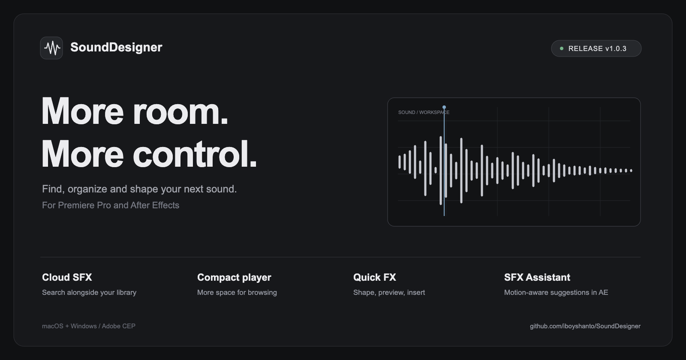

<div align="center">



**Find it. Shape it. Drop it into the edit.**

A fast, project-aware sound-effects workspace for **Adobe Premiere Pro** and **After Effects**.

<p>
  <a href="https://github.com/iboyshanto/SoundDesigner/releases/latest"></a>
  <a href="https://github.com/iboyshanto/SoundDesigner"></a>
  <a href="https://github.com/iboyshanto/SoundDesigner/blob/main/LICENSE"></a>
  <br>
  
  
  
</p>

[**Website**](https://sounddesigner-web.vercel.app) · [**Download Latest**](https://github.com/iboyshanto/SoundDesigner/releases/latest) · [**Report a Bug**](https://github.com/iboyshanto/SoundDesigner/issues) · [**Release Guide**](RELEASING.md)

</div>

---

## 🧭 Explore

**New in v1.0.3:** Cloud SFX, SFX Assistant for After Effects, Favorites collections, waveform tiles, Quick FX and a compact player dock. [Read the release notes](.github/releases/v1.0.3.md).

- [Meet SoundDesigner](#meet-sounddesigner)
- [Features](#features)
- [Get started](#get-started)
- [Preview, select and shape](#preview-select-shape)
- [Connect Freesound](#connect-freesound)
- [Project audio and conversion](#project-audio-conversion)
- [Settings](#settings)
- [Development](#development)
- [Publishing](#publishing)
- [Troubleshooting](#troubleshooting)
- [Developers](#developers)
- [License](#license)

---

<a id="meet-sounddesigner"></a>

## ✨ Meet SoundDesigner

SoundDesigner keeps sound design close to the timeline. Browse local folders and Freesound from one panel, inspect real channel waveforms, select the exact moment you need, shape it with realtime effects, and insert it without breaking your creative flow.

> [!IMPORTANT]
> No more scattered media. SoundDesigner automatically creates a `SoundDesigner` bin or folder in the Adobe Project panel and organizes every sound inserted through the extension inside it.

### From search to timeline

```text
Local library + Freesound
           ↓
 Search, filter and preview
           ↓
 Select a segment and shape it
           ↓
 Drag, double-click or Insert
           ↓
 Organized SoundDesigner project media
```

---

<a id="features"></a>

## 💎 Everything You Need to Design Sound

<table>
  <tr>
    <td width="50%" valign="top">
      <h3>🔍 One Search, Multiple Libraries</h3>
      <p>Browse preserved local folder trees and optional Freesound results together. Enable either source—or both—from the Library panel.</p>
    </td>
    <td width="50%" valign="top">
      <h3>〰️ Real Audio Waveforms</h3>
      <p>Preview decoded mono and stereo channels, zoom, seek, loop, and see the sound you are actually hearing.</p>
    </td>
  </tr>
  <tr>
    <td width="50%" valign="top">
      <h3>✂️ Precision Segment Selection</h3>
      <p>Drag across the waveform, refine the selection, audition only that range, then insert or drag exactly the part you need.</p>
    </td>
    <td width="50%" valign="top">
      <h3>🎛️ Realtime Sound Shaping</h3>
      <p>Reverse, adjust gain, shift pitch, change speed, or lock pitch while auditioning. The same processing follows the sound into Adobe.</p>
    </td>
  </tr>
  <tr>
    <td width="50%" valign="top">
      <h3>☁️ Freesound On Demand</h3>
      <p>Search and preview cloud sounds inside the panel. Files download only when you drag or insert them, with visible progress.</p>
    </td>
    <td width="50%" valign="top">
      <h3>⚡ Adobe-Ready Audio</h3>
      <p>Unsupported audio can be converted to 24-bit PCM WAV automatically, with optional peak normalization and no bundled FFmpeg binary.</p>
    </td>
  </tr>
  <tr>
    <td width="50%" valign="top">
      <h3>🗂️ Project-Smart Organization</h3>
      <p>Prepared audio is stored beside the saved Adobe project, while imported media stays grouped in a dedicated SoundDesigner bin.</p>
    </td>
    <td width="50%" valign="top">
      <h3>📐 Built for Dockable Panels</h3>
      <p>The interface adapts to wide, compact, short, and vertical layouts while keeping the waveform and essential controls available.</p>
    </td>
  </tr>
</table>

### More workflow essentials

- Recursive local-library indexing with the original folder hierarchy preserved.
- Multiple independent search tabs, favorites, filters, sorting, and adjustable result density.
- Auto-preview, looping, channel display controls, waveform zoom, and keyboard navigation.
- Drag-and-drop, double-click insertion, and a dedicated **Insert** action.
- Full-sound and selection-only processing without overwriting the source audio.
- Cached downloads, conversions, waveforms, and rendered segments for faster reuse.
- Stable update checks that open an explicit download instead of silently replacing the extension.

---

<a id="get-started"></a>

## 🚀 Get Started

### Compatibility

| Requirement | Minimum |
| --- | --- |
| **Adobe Premiere Pro** | 15.4 or newer |
| **Adobe After Effects** | 18.4 or newer |
| **Adobe extension runtime** | CEP 11 / Chromium 88 |
| **Installer** | Windows setup EXE or macOS drag-install DMG |
| **Internet** | Only for Freesound and update checks |

### Install

Download the installer for your operating system from [GitHub Releases](https://github.com/iboyshanto/SoundDesigner/releases/latest):

- **Windows:** run `SoundDesigner-vX.Y.Z-Windows-Setup.exe` and approve the administrator prompt. The setup app safely replaces an older installation.
- **macOS:** open `SoundDesigner-vX.Y.Z-macOS.dmg`, then drag **SoundDesigner** onto **Adobe CEP Extensions**. Finder may request administrator access.

Restart Premiere Pro or After Effects, then open **Window → Extensions** or **Window → Extensions (Legacy)** and choose **SoundDesigner**.

Each installer has a matching `.sha256` file on the release page. The signed `.zxp` is also available as an advanced manual-install fallback.

> [!TIP]
> Save the Adobe project before using cloud audio, conversion, effects rendering, or segment export. SoundDesigner uses the project location to keep prepared media portable and organized.

### Add a local library

1. Select **Add sound folder** in the Library panel.
2. Choose the top-level folder containing your sound effects.
3. Keep **Local** enabled in the source list.
4. Search, browse the folder tree, and select a sound to preview it.
5. Drag it into the timeline or composition, double-click it, or select **Insert**.

SoundDesigner indexes nested folders but leaves every original file where it is. Removing a library from the extension never deletes the source folder.

---

<a id="preview-select-shape"></a>

## 🎧 Preview, Select and Shape

The spectrum preview is a channel-aware waveform editor—not a decorative animation.

### Select the exact moment

- Drag horizontally across the waveform to create a selection.
- Drag either edge to refine the start or end.
- Playback stays inside the selected range and respects looping.
- Drag the highlighted range or choose **Insert segment** to use only that moment.
- Clear the selection to return to the full sound.

### Shape the sound non-destructively

| Effect | Control | What it does |
| --- | --- | --- |
| **Reverse** | On/off | Reverses the full sound or only the active selection |
| **Gain** | −24 dB to +12 dB | Raises or lowers the output level |
| **Pitch** | −12 to +12 semitones | Shifts pitch independently |
| **Speed** | 0.50× to 2.00× | Changes playback speed and rendered duration |
| **Pitch Lock** | Locked/unlocked | Preserves pitch while speed changes |

Effects are previewed in realtime and applied consistently when the sound or selected segment is dragged or inserted. **Reset** returns all controls to their neutral values.

### Useful shortcuts

| Key | Action |
| --- | --- |
| `Space` | Play or pause the extension preview while focus is inside the panel |
| `Ctrl+K` / `Cmd+K` | Focus and select the search field |
| `Escape` | Close the FX rack, settings, drawer, or transient interface |
| `Enter` on waveform | Create a short selection around the playhead |
| Arrow keys | Seek or adjust the focused selection handle |
| `Shift+Arrow` | Make a larger seek or selection adjustment |
| `Home` / `End` | Move a selection boundary to the beginning or end |

Typing inside an input field is never intercepted by preview shortcuts.

---

<a id="connect-freesound"></a>

## ☁️ Connect Freesound

Freesound is optional. When enabled, Local and Freesound become independent sources in the Library panel, so users can search either one or both at the same time.

SoundDesigner uses the official Freesound API with a personal key. It does not scrape the website and does not ship with a shared credential.

### 1. Create a Freesound credential

1. [Create a Freesound account](https://freesound.org/home/register/) or sign in.
2. Open the [API credentials page](https://freesound.org/apiv2/apply/).
3. Create a credential using:

   | Field | Suggested value |
   | --- | --- |
   | **Name** | `SoundDesigner` |
   | **URL** | `https://github.com/iboyshanto/SoundDesigner` |
   | **Callback URL** | `http://freesound.org/home/app_permissions/permission_granted/` |

   SoundDesigner uses token authentication, not an OAuth2 login flow. The callback is the Freesound-provided fallback for desktop and non-server applications.
4. Submit the form and find the new credential in the table.

### 2. Copy the correct key

Copy the long value under **Client secret/API key**—not the shorter **Client ID**.

Treat the key like a password:

- Do not commit it to the repository.
- Do not share it in screenshots, issues, or discussions.
- Do not bundle one personal key with public builds.
- Revoke or regenerate it if it becomes exposed.

### 3. Enable Freesound in SoundDesigner

1. Open **Settings → Freesound**.
2. Enable **Freesound library**.
3. Paste the **Client secret/API key** into **Personal API key**.
4. Choose a license filter and select **Save changes**.
5. Enable **Freesound** in the Library panel.
6. Enter at least two search characters.

**Browse without key** opens Freesound in the default browser. Searching and previewing Freesound inside the panel requires a personal API credential.

> [!WARNING]
> Every Freesound item keeps its own Creative Commons license. CC BY sounds require attribution. Free API access is for non-commercial use; commercial API use must be arranged with Freesound/UPF. Read the official [authentication guide](https://freesound.org/docs/api/authentication.html) and [API terms](https://freesound.org/help/tos_api/).

---

<a id="project-audio-conversion"></a>

## 🗂️ Project Audio and Conversion

Directly supported local audio can be inserted from its original location. When a cloud download, conversion, normalization, effect, or selected segment needs a new file, SoundDesigner stores it beside the saved Adobe project:

```text
<Project folder>/
└── SoundDesigner/
    └── <Project name>/
        ├── Freesound/
        │   └── Originals/
        ├── Converted/
        ├── Segments/
        └── Metadata/
```

| Folder | Purpose |
| --- | --- |
| `Freesound/Originals` | Provider previews downloaded only when needed |
| `Converted` | Adobe-compatible, normalized, or effect-processed WAV files |
| `Segments` | Rendered waveform selections |
| `Metadata` | Source, license, conversion, processing, and selection records |

Prepared filenames use stable fingerprints so valid outputs can be reused without collisions between projects or processing settings.

### Conversion options

- **Convert unsupported audio to WAV** — recommended; prepares only formats outside the direct Adobe compatibility list.
- **Always convert imported audio to WAV** — creates a project-scoped WAV for every sound.
- **Never convert automatically** — passes the original file to Adobe, which may reject unsupported audio.
- **Preserve original level** — keeps the decoded source level.
- **Peak normalize to −1 dBFS** — applies one consistent gain value across all channels.

Converted output is 24-bit PCM WAV with its sample rate and channel count preserved. Temporary files are finalized atomically so cancelled or failed work does not look complete.

> [!NOTE]
> SoundDesigner recognizes many common audio extensions, including WAV, AIFF, MP3, AAC/M4A, FLAC, OGG, Opus, WMA, APE, and WebM audio. Actual preview and conversion still depend on the audio decoders available in CEP 11; an uncommon codec that cannot be decoded is reported instead of being imported as an invalid file.

---

<a id="settings"></a>

## ⚙️ Settings at a Glance

| Setting | Purpose |
| --- | --- |
| **Auto-preview selection** | Starts auditioning when the selected result changes |
| **Loop previews** | Keeps playback running until stopped or another sound is chosen |
| **Playhead / selected clip** | Chooses where Adobe places inserted audio |
| **Adobe compatibility** | Controls automatic WAV conversion |
| **Normalization** | Preserves the source level or peak-normalizes prepared audio |
| **Enable Freesound library** | Adds or removes the optional cloud source |
| **License filter** | Restricts Freesound searches to the chosen license group |
| **Updates** | Checks stable GitHub Releases without installing silently |

---

<a id="development"></a>

## 🛠️ Development

The panel is built with **Svelte 5** and **Vite** through the **Bolt CEP** toolchain. Host integrations are compiled separately for ExtendScript/ES3 compatibility.

**Requirements:** [Bun 1.3.14](https://bun.sh/) and Node.js compatibility for CEP packaging and release utilities.

```sh
# Install the locked dependencies
bun install --frozen-lockfile

# Start the development server
bun run dev

# Type-check the Svelte application
bun run check

# Test audio effects and WAV rendering
bun run test:audio

# Test per-tab folder naming and search state
bun run test:search-tabs

# Compile the CEP extension
bun run build
```

`bun run dev` starts the browser development surface. To test Adobe host integration, build or symlink the CEP extension and open it inside a supported Premiere Pro or After Effects version.

### Project map

| Path | Responsibility |
| --- | --- |
| `src/js/main` | Svelte UI, libraries, waveform, Freesound, conversion, and processing |
| `src/jsx/ppro` | Premiere Pro host integration |
| `src/jsx/aeft` | After Effects host integration |
| `scripts` | Smoke tests, certificate creation, release packaging, and platform installer builders |
| `cep.config.ts` | CEP hosts, runtime floor, manifest, and build configuration |
| `.github/workflows/main.yml` | Tagged signed ZXP, EXE, and DMG release automation |

---

<a id="publishing"></a>

## 📦 Publishing

Production releases require a persistent publisher certificate. Keep both the certificate and its password secure; users need the same publisher identity for seamless updates.

```sh
# Create a persistent local certificate once
bun run certificate:create

# Test, build, sign the ZXP, and generate its SHA-256 checksum
bun run release:package
```

The signed ZXP in `release/` is the input for both platform installers:

```sh
# Windows only: build the branded setup EXE
bun run installer:windows

# macOS only: build the branded drag-install DMG
bun run installer:macos

# Validate installer scripts, paths, and workflow wiring
bun run test:installers
```

The EXE must be built on Windows and the DMG on macOS. Pushing a semantic version tag such as `v1.2.3` runs `.github/workflows/main.yml`, builds both installers and their SHA-256 files, and prepares a **draft** GitHub Release. The workflow requires these repository secrets:

- `SOUNDDESIGNER_ZXP_CERT_BASE64` — the publisher `.p12` encoded as Base64.
- `SOUNDDESIGNER_ZXP_PASSWORD` — the certificate password.

Add matching release notes at `.github/releases/vX.Y.Z.md` before pushing the tag. Review and test the draft artifacts before publishing. See [RELEASING.md](RELEASING.md) for the complete release checklist.

---

<a id="troubleshooting"></a>

## 🧰 Troubleshooting

<details>
<summary><strong>Cloud audio or conversion says the project must be saved</strong></summary>

Save the Premiere Pro or After Effects project and retry. Project-scoped audio needs a stable project directory.
</details>

<details>
<summary><strong>Freesound does not appear in the Library panel</strong></summary>

Enable **Freesound library** in Settings, enter a valid personal API key, save, and then enable the Freesound source in the Library panel.
</details>

<details>
<summary><strong>Only local or only cloud results appear</strong></summary>

Local and Freesound are independent switches. Enable both in the Library panel to search both sources together.
</details>

<details>
<summary><strong>A format is indexed but will not preview or convert</strong></summary>

Indexing and decoding are different steps. Keep **Convert unsupported audio to WAV** enabled. If CEP cannot decode the source, convert it externally to WAV, AIFF, MP3, AAC, or M4A and rescan the library.
</details>

<details>
<summary><strong>Inserted audio is missing from the SoundDesigner bin</strong></summary>

Confirm that an Adobe project—and, in After Effects, an active composition—is open. Retry with **Insert** so the host integration can create the bin or folder.
</details>

---

## 🔒 Respectful by Design

- Original local audio is never overwritten by conversion or effects.
- Freesound credentials are user-provided preferences and are never committed by the project.
- Cloud downloads are limited to trusted Freesound HTTPS hosts and use bounded file sizes.
- Interrupted temporary downloads and renders are cleaned up.
- Updates are explicit: SoundDesigner never silently replaces the installed extension.

---

<a id="developers"></a>

## 👨‍💻 Developers

SoundDesigner is developed and maintained by:

- [@raselerkaj](https://t.me/raselerkaj)
- [@itsniloybhowmick](https://t.me/itsniloybhowmick)

---

<a id="license"></a>

## 📜 License

SoundDesigner is distributed under the [MIT License](LICENSE).

Freesound content is not covered by the SoundDesigner license. Each downloaded sound remains subject to its own license and attribution requirements.

<div align="center">
  <strong>Built for editors who want to spend more time designing sound—and less time managing files.</strong>
</div>
